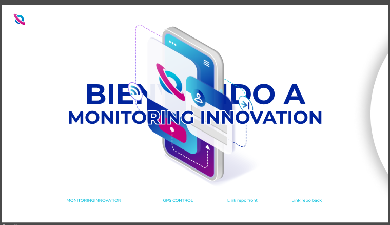
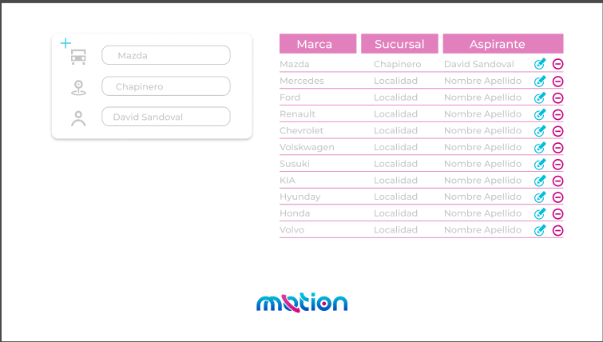

# gps-technical-assessment

Create a backend and a frontend for a CRUD system. The backend should consist of end points that allow the frontend to manipulate the data of a table in order to implement the CRUD system.

The frontend must be a web page based on the provided design and should have the ability to consume the APIs established in the backend.

<div>
    
    
</div>

## Frontend 

Angular version 16.2.12. Inside the directory frontend execute ```npm install``` and then ```ng serve -o```


## Backend 

Django. Create a virtual environment in python ```python -m venv venv``` and activate. The execute the command ```pip install -r requirements.txt``` 

## Deployment

- [Project deployed](https://sage-smakager-fb0575.netlify.app/)
- Frontend Netlify
- Backend Render 